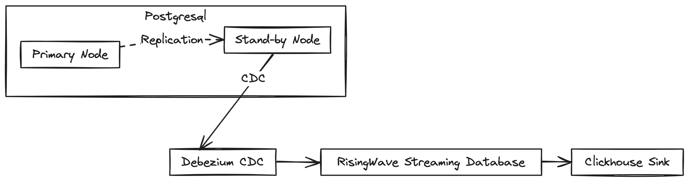

# Streaming Analytics

_Initial draft_

## Overview

This project is an effort to mimic a streaming analytics pipeline. In general, this pipeline will stream data from 
**OLTP** database to **OLAP** database, which has the following details:

1. **OLTP**: **Postgresql** will serve as a producer. A **replication** mechanism can be implemented to ensure the high
   availability - if the primary server fails, one of the stand-bys can take over. There are two kinds of replication in
   Postgresql: **Streaming Replication** and **Logical Replication**.
2. **Change Data Capture (CDC)**: To capture any change on the upstream source, we will use **CDC** technique.
   **Debezium** with **Kafka - Postgresql** connector will be applied here. **Debezium** is widely
   regard as an industrial standard for **CDC** mechanism.
3. **Streaming Processor and/or Database**: **Flink** (streaming processor) or **SparkStructuredStreaming**
   (streaming processor), **RisingWave** (streaming database) are our top options.
   (_This part will be considered after I finish the **OLTP** and **CDC** parts. Note that there are also many other
   options besides these three_).
4. **OLAP**: **Clickhouse** is our OLAP database here. Clickhouse is one of the most popular OLAP database in the market,
it also has OSS version with detailed documentation, which makes our implementation easier.
5. **Observability**: This pipeline should have one but first, let me finish 4 previous parts.

